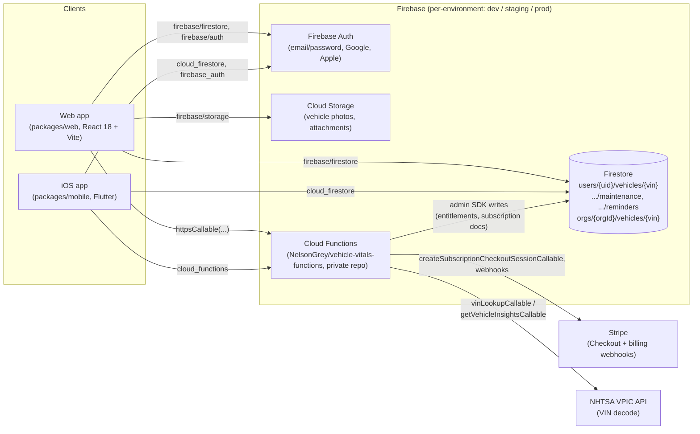

# Vehicle-Vitals

One garage for every vehicle record, reminder, and repair cost.

Vehicle-Vitals is a cross-platform vehicle management application — web (React) and iOS (Flutter) — backed by Firebase. It lets owners track service history, plan upcoming maintenance, and build a credible ownership record across personal vehicles, shared household vehicles, and light business fleets.

## Demo

### Architecture



There is **no custom REST/GraphQL server** — both clients talk to Firebase directly for reads/writes, and route anything that needs a secret (VIN decoding, Stripe checkout, entitlement grants) through callable Cloud Functions in the companion `vehicle-vitals-functions` repo (kept private because this repo is public).

### Walkthrough: adding a vehicle by VIN

1. User submits a VIN on `packages/web/src/pages/AddVehicle.tsx`, which calls `lookupVin(vin)` in `packages/web/src/utils/vehicleService.js`.
2. `lookupVin` invokes the `getVehicleInsightsCallable` Cloud Function (`firebaseService.httpsCallable(functions, 'getVehicleInsightsCallable')`), which in turn calls the NHTSA VPIC decode API server-side and returns profile data plus recall info:

   ```json
   // getVehicleInsightsCallable response (fields used by buildPersistedVinInsights)
   {
     "success": true,
     "free": {
       "vinProfile": {
         "make": "Honda",
         "model": "Accord",
         "year": "2021",
         "engineType": "I4",
         "bodyClass": "Sedan/Saloon",
         "trim": "EX-L"
       },
       "recalls": { "count": 1, "source": "NHTSA", "items": [ /* ... */ ] }
     }
   }
   ```

3. `AddVehicle.tsx` merges that with user-entered fields (mileage, purchase date, photo) starting from `defaultVehicle` (`packages/shared/src/types.js`), then calls `addOrUpdateVehicle(vehicle)` from `packages/shared/src/firestoreServiceFactory.js`.
4. `addOrUpdateVehicle` resolves whether the vehicle belongs to the user's personal garage or a household/org garage (`resolveVehicleScope`) and writes to `users/{uid}/vehicles/{vin}` (or `orgs/{orgId}/vehicles/{vin}` for shared garages), stamping `createdAt`/`updatedAt`.
5. Logging a repair later calls `addMaintenanceEntry(vin, entry)`, which writes to the `.../vehicles/{vin}/maintenance` subcollection; setting a reminder calls `addReminder(vin, reminder)`, writing to `.../vehicles/{vin}/reminders` with a `status` of `active`/`snoozed`/`dismissed`/`completed` managed by `completeReminder`/`snoozeReminder`/`dismissReminder`.
6. Upgrading tiers (Free → Pro → Premium, see the pricing table below) calls `createSubscriptionCheckoutSession()` in `packages/web/src/shared/entitlementsService.ts`, which invokes `createSubscriptionCheckoutSessionCallable` and either redirects to Stripe Checkout or returns an already-activated entitlement; the resulting subscription state is read back client-side (read-only) from `users/{uid}/subscription/current` in `packages/web/src/shared/subscriptionService.ts` — Firestore rules block clients from writing that document directly, since tier changes are only granted server-side.

## Who it's for

| Persona | Need | Recommended tier |
|---|---|---|
| **Ownership Records** | Keep every service record ready when it matters | Free → Pro |
| **Shared Garage** | Coordinate every vehicle in one shared garage | Pro |
| **Guided Setup** | Know what to track from day one | Free → Pro |
| **Hands-On Maintenance** | Document the work you do yourself | Pro → Premium |
| **Work Vehicles** | Keep business vehicles ready, documented, and accountable | Premium → Enterprise |

## Subscription tiers

| Tier | Price | Vehicles | Positioning |
|---|---|---|---|
| **Free** | Free | 2 | Learn and document |
| **Pro** | $2.99/month | 10 | Plan and coordinate |
| **Premium** | $6.99/month | 25 | Forecast and automate |
| **Enterprise** | Custom | 25+ | Govern and integrate |

## Repository structure

```
packages/
├── shared/      # Common types, Firebase services, Firestore factory, feature flags
├── web/         # React 18 + Vite + Tailwind web app (public marketing + authenticated app)
└── mobile/      # Flutter iOS app (Android on hold)
```

Supporting packages: `packages/firebase-utils` (admin SDK helpers).

**Firebase Cloud Functions** (reminders, VIN, calendar, billing, entitlements,
providers) live in a separate private repo,
[NelsonGrey/vehicle-vitals-functions](https://github.com/NelsonGrey/vehicle-vitals-functions)
— this repo is public, and that code shouldn't be. CI checks out the
companion repo automatically at deploy time; for local development or
`firebase emulators:start`, clone it into the gitignored `packages/functions/`
path:
```bash
git clone git@github.com:NelsonGrey/vehicle-vitals-functions.git packages/functions
npm run build --workspace=@vehicle-vitals/shared
cd packages/functions && VV_SHARED_DIST=../shared/dist npm run vendor:shared
```

## Documentation

**Product & business**

| Doc | Purpose |
|---|---|
| [docs/PRODUCT_DESIGN.md](docs/PRODUCT_DESIGN.md) | Product vision, persona definitions, tier matrix, UX flows |
| [docs/APP_ALIGNMENT_PLAN.md](docs/APP_ALIGNMENT_PLAN.md) | Web app + iOS changes needed to align with marketing direction |
| [docs/REQUIREMENTS.md](docs/REQUIREMENTS.md) | Feature implementation status and production-readiness baseline |
| [docs/NEXT_FEATURES_EXECUTION_PLAN.md](docs/NEXT_FEATURES_EXECUTION_PLAN.md) | Prioritized execution roadmap (post-launch) |
| [docs/MONETIZATION_STRATEGY.md](docs/MONETIZATION_STRATEGY.md) | Subscription tiers, ad placements, revenue model |

**Release & operations**

| Doc | Purpose |
|---|---|
| [docs/GO_LIVE_RUNBOOK.md](docs/GO_LIVE_RUNBOOK.md) | Go-live checklist and launch record (App Store: approved, live) |
| [docs/DEPLOY.md](docs/DEPLOY.md) | Deployment guide for all environments |
| [docs/PROD_SETUP_GUIDE.md](docs/PROD_SETUP_GUIDE.md) | Production secrets and environment setup |

**Developer reference**

| Doc | Purpose |
|---|---|
| [docs/DEVELOPER_GUIDE.md](docs/DEVELOPER_GUIDE.md) | Local dev setup, testing workflow, conventions |
| [docs/ARCHITECTURE.md](docs/ARCHITECTURE.md) | System architecture and data flow |
| [docs/FIREBASE_CONFIG.md](docs/FIREBASE_CONFIG.md) | Firebase configuration and multi-environment patterns |
| [docs/FIREBASE_INDEXES.md](docs/FIREBASE_INDEXES.md) | Firestore composite indexes |
| [docs/MONETIZATION_DEVELOPER_GUIDE.md](docs/MONETIZATION_DEVELOPER_GUIDE.md) | Feature flags, entitlement hooks, tier gating |
| [docs/IOS_SIGNING_AND_CICD.md](docs/IOS_SIGNING_AND_CICD.md) | iOS code signing (ASC API key + automatic signing) and CI/CD |

## Quick start

### Web

```bash
npm install          # install all workspace dependencies
npm run dev:web      # start Vite dev server
npm run build:web    # production build
```

### Mobile (iOS)

```bash
cd packages/mobile
flutter pub get
flutter run -d ios
```

### Functions (local emulator)

Requires cloning the [functions companion repo](#repository-structure) into
`packages/functions` first (see above).

```bash
firebase emulators:start --only firestore,functions,auth
```

## Testing

```bash
# Web unit tests (Vitest)
npm --workspace=@vehicle-vitals/web run test:unit

# Shared package tests (Vitest)
cd packages/shared && npx vitest run tests

# Mobile tests (Flutter)
cd packages/mobile && flutter test && flutter analyze

# Functions tests (node --test; requires the companion repo cloned in first)
npm --workspace=functions run test

# Web UAT (Playwright — requires a running dev or staging URL)
npm --workspace=@vehicle-vitals/web run test:uat:chromium
```

## Environments

| Environment | Firebase project | Branch | Purpose |
|---|---|---|---|
| Development | `vehicle-vitals-dev` | `develop` | Active development |
| Staging | `vehicle-vitals-staging` | `staging` | Pre-release validation |
| Production | `vehicle-vitals-prod` | `main` | Live application |

The `VITE_SHOW_COMING_SOON_PRODUCTION` GitHub secret controls whether production shows the coming-soon gate or the full app.

## CI/CD

The master pipeline (`master-pipeline.yml`) runs on `staging` and `main`. It gates on:

1. **Quality Gate** — web unit tests + mobile unit tests
2. **Build Web App** — Vite production build
3. **Build iOS App** — Xcode archive (macOS runner)
4. **Deploy Firebase** — Hosting, Firestore, Storage, Functions, Indexes

Use `gh workflow run master-pipeline.yml -f action=build_and_deploy -f environment=staging` to trigger manually.

## Conventions

- **Auth**: components read from `AuthContext`; do not access `auth.currentUser` directly outside services.
- **Data shape**: use `defaultVehicle` from `packages/shared/src/types.js` when creating vehicles.
- **Feature gating**: use `useSubscription()` and `hasFeature()` from `packages/web/src/shared/featureFlags.ts`; never hard-code tier checks in UI components.
- **Firestore paths**: user data lives at `users/{uid}/vehicles/{vin}`; org data at `orgs/{orgId}/vehicles/{vin}`.
- **Bundle ID**: `com.vehiclevitals` (migrated from `com.nelsongrey.vehiclevitals` June 2026).

## iOS app distribution

Internal testers receive builds via Firebase App Distribution. Production will use TestFlight / App Store.

```bash
cd packages/mobile
bundle exec fastlane ios beta    # build + distribute to internal testers
```

Signing is via an App Store Connect API key + Xcode automatic signing (no
certificate repo, no Fastlane Match). See [docs/IOS_SIGNING_AND_CICD.md](docs/IOS_SIGNING_AND_CICD.md).

## Android status

Android is on hold. The CI pipeline skips Android jobs. Do not include Android in launch copy or store plans until the Android deployment path is re-established.

## Support

- User support: support@vehicle-vitals.com
